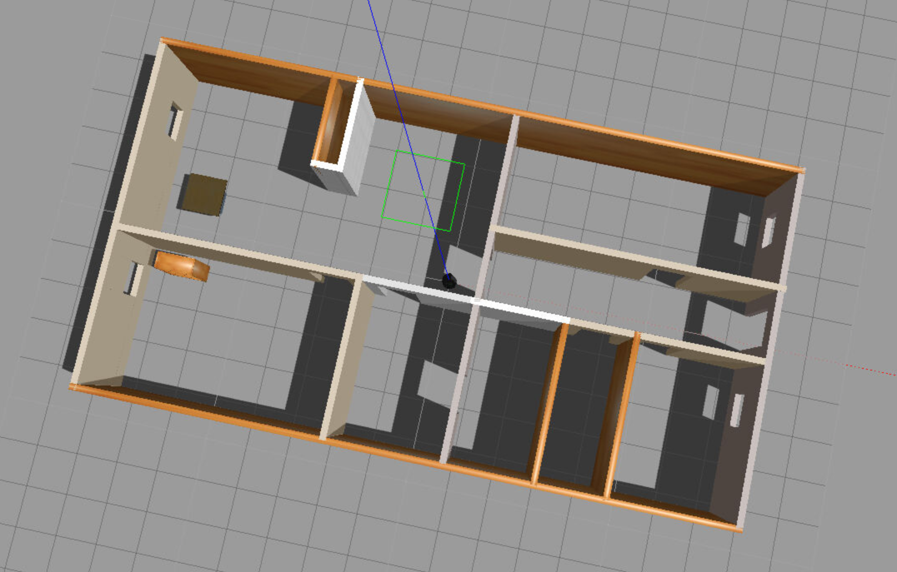
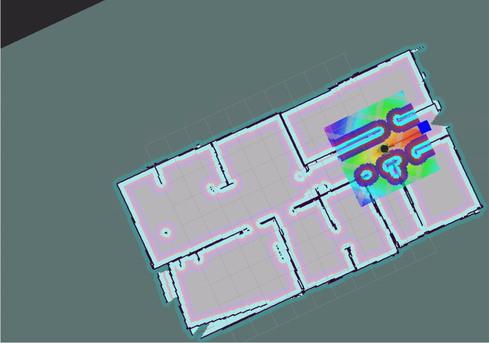

# udacity_robotics_project7
Repository for Udacity's Robotics Software Engineer nanodegree project7.

## Project Overview
This project simulates simple home service robot navigation task using ROS and gazebo.

### Packages
- [gmapping](http://wiki.ros.org/gmapping) is used to perform SLAM and build a map.
- [turtlebot_gazebo](http://wiki.ros.org/turtlebot_gazebo) deploys a turtlebot in gazebo environment and performs SLAM and AMCL.
- [turtlebot_rviz_launchers](http://wiki.ros.org/turtlebot_rviz_launchers) provides preconfigured rviz workspace. Rviz configuration in this repository is based on this package.
- [turtlebot_teleop](http://wiki.ros.org/turtlebot_teleop) is used to move a robot with keyboard while building a map.
- `pick_objects` package navigates a robot from pickup zone to dropoff zone using ROS Navigation Stack.
- `add_markers` package displays a marker in rviz, which models a virtual object picked and delivered by the robot.

### Simulation Environment
[Apartment.world](map/Apartment.world) is used as the world file in gazebo.   


## Setup
Create catkin workspace directory and clone this repositoy:
```shell
# Create catkin workspace
mkdir -p catkin_ws/src
cd catkin_ws/src

# Clone repository
git clone --recursive https://github.com/wikrsh/udacity_robotics_project7.git .

# Create CMakeLists.txt
catkin_init_workspace
```
Then, build packages:
```shell
cd catkin_ws
catkin_make
```

## Build a map
`test_slam.sh` runs following launch files: 
- `turtlebot_gazebo turtlebot_world.launch` 
- `turtlebot_gazebo gmapping_demo.launch` 
- `turtlebot_rviz_launchers view_navigation.launch`
- `turtlebot_teleop keyboard_teleop.launch`
```shell
./src/scripts/test_slam.sh
```
After gazebo starts, find a xterm window that runs `keyboard_teleop.launch` and move the robot around the environment.  

Once a map is built, exports the map with following command:
```shell
rosrun map_server map_saver
```

## Run simulation
`home_service.sh` runs a simulation of this project.
```shell
./src/scripts/home_service.sh
```
`home_service.sh` launches `pick_objects` node and `add_markers` node.  

### `pick_objects` node
`pick_objects` node navigates the robot from pickup position to dropoff position. (Both pickup and dropoff position are pre-defined and fixed.)
After `pick_objects` node starts, the node moves the robot from its initial position to pickup position. Once the robot reaches pickup position, the node waits 5 seconds and then moves the robot to dropoff position.

### `add_markers` node
`add_markers` node displays a marker in rviz, which models a virtual object picked and delivered by the robot.
Initially, `add_markers` node shows a marker at pickup zone. Once the robot reaches pickup zone, the node hides the marker. After that, the node shows a marker at dropoff zone once the robot reaches dropoff zone.  

To check if the robot reaches pickup/dropoff zone, the node calculates distance between pickup/dropoff position and the robot based on the estimated pose from `amcl_pose` topic. When the distance becomes smaller than the threshold, the node considers the robot has reached pickup zone.


